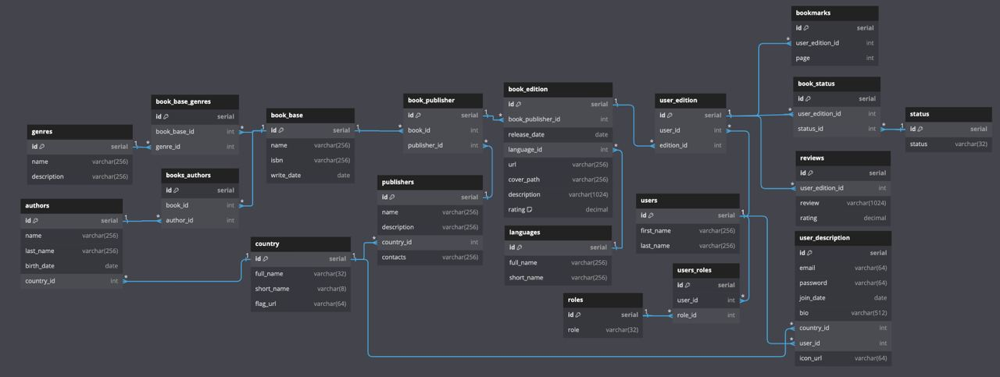
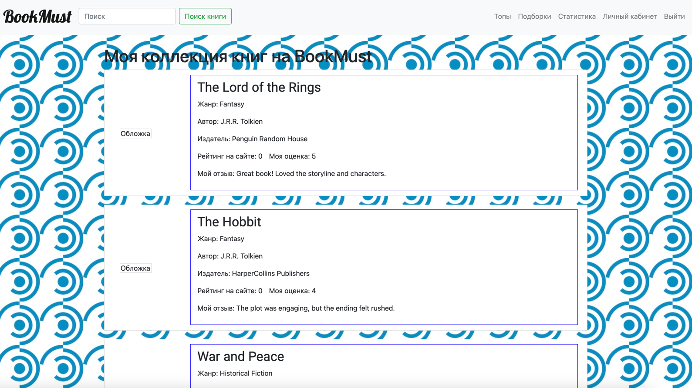
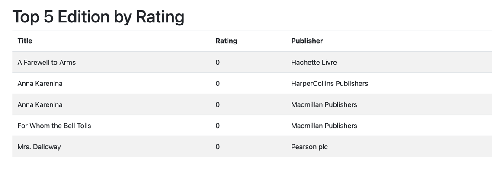

# launch:
```sh
git clone https://github.com/stas224/BookMust2.0.git
brew install pkg-config libvirt
python3 -m venv venv
source venv/bin/activate 
pip install -r requirements.txt
/usr/bin/bash ./postgres_init.sh
/usr/bin/bash ./redis_init.sh
localstack start --host
```
## todo-list:
- [x] Придумать тему 
- [x] Организовать отношения в реляционной базе данных
- [ ] личный кабинет
- [x] авторизация
- [x] поиск
- [x] s3 connector
- [ ] key-value

- [x] логика добавления книги в коллекцию пользователя
- [x] логика изменения статусов книги в коллекции пользователя
- [x] логика удаления книги из коллекции пользователя
- [ ] логика добавления книги в пул
- [ ] логика изменения книги в пуле
- [ ] логика удаления книги из пула

- [ ] Топы
- [ ] Подборки
- [ ] Статистика

## sql-schema:



### book-details:


### top-editions:
