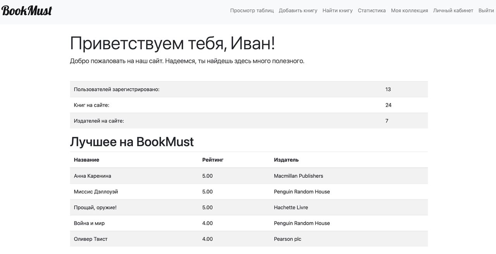

# launch:
```sh
git clone https://github.com/stas224/BookMust2.0.git
brew install pkg-config libvirt
python3 -m venv venv
source venv/bin/activate 
pip install -r requirements.txt
/usr/bin/bash ./postgres_init.sh
/usr/bin/bash ./redis_init.sh
localstack start --host
```

## sql-schema:


## index page:


## collection page:

